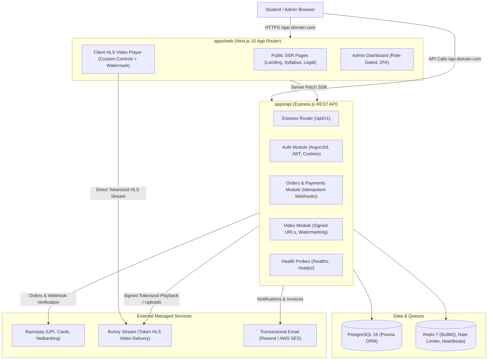
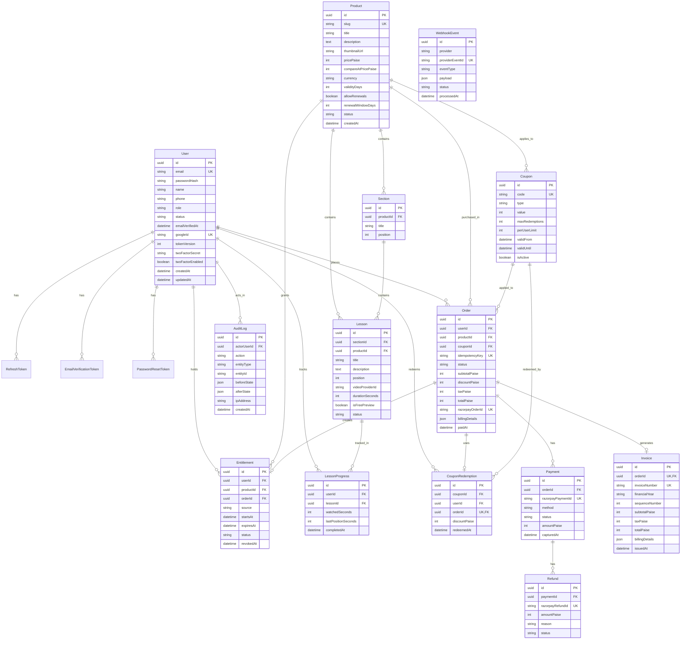

# System Architecture & Domain Model

## 1. High-Level System Architecture

```mermaid
graph TD
    Client["Student / Admin Browser"]

    subgraph Frontend ["apps/web (Next.js 15 App Router)"]
        PublicSSR["Public SSR Pages (Landing, Syllabus, Legal)"]
        ClientPlayer["Client HLS Video Player (Custom Controls + Watermark)"]
        AdminDashboard["Admin Dashboard (Role-Gated, 2FA)"]
    end

    subgraph Backend ["apps/api (Express.js REST API)"]
        Router["Express Router (/api/v1)"]
        AuthMod["Auth Module (Argon2id, JWT, Cookies)"]
        OrderMod["Orders & Payments Module (Idempotent Webhooks)"]
        VideoMod["Video Module (Signed URLs, Watermarking)"]
        HealthMod["Health Probes (/healthz, /readyz)"]
    end

    subgraph Storage ["Data & Queues"]
        Postgres[("PostgreSQL 16 (Prisma ORM)")]
        Redis[("Redis 7 (BullMQ, Rate Limiter, Heartbeats)")]
    end

    subgraph External ["External Managed Services"]
        RazorpayGateway["Razorpay (UPI, Cards, Netbanking)"]
        BunnyStream["Bunny Stream (Token HLS Video Delivery)"]
        EmailService["Transactional Email (Resend / AWS SES)"]
    end

    Client -->|HTTPS /app.domain.com| Frontend
    Client -->|API Calls /api.domain.com| Backend
    Frontend -->|Server Fetch SSR| Backend
    Backend --> Postgres
    Backend --> Redis
    Backend -->|Orders & Webhook Verification| RazorpayGateway
    Backend -->|Signed Tokenized Playback / Uploads| BunnyStream
    Backend -->|Notifications & Invoices| EmailService
    ClientPlayer -->|Direct Tokenized HLS Stream| BunnyStream
```

---

## 2. Entity-Relationship (ER) Diagram

```mermaid
erDiagram
    User ||--o{ RefreshToken : has
    User ||--o{ EmailVerificationToken : has
    User ||--o{ PasswordResetToken : has
    User ||--o{ Order : places
    User ||--o{ Entitlement : holds
    User ||--o{ LessonProgress : tracks
    User ||--o{ CouponRedemption : redeems
    User ||--o{ AuditLog : acts_in

    Product ||--o{ Section : contains
    Product ||--o{ Lesson : contains
    Product ||--o{ Order : purchased_in
    Product ||--o{ Entitlement : grants
    Product ||--o{ Coupon : applies_to

    Section ||--o{ Lesson : contains

    Lesson ||--o{ LessonProgress : tracked_in

    Order ||--o{ Payment : has
    Order ||--o| Invoice : generates
    Order ||--o| Entitlement : creates
    Order ||--o| CouponRedemption : uses

    Payment ||--o{ Refund : has

    Coupon ||--o{ CouponRedemption : redeemed_by
    Coupon ||--o{ Order : applied_to

    User {
        uuid id PK
        string email UK
        string passwordHash
        string name
        string phone
        string role
        string status
        datetime emailVerifiedAt
        string googleId UK
        int tokenVersion
        string twoFactorSecret
        boolean twoFactorEnabled
        datetime createdAt
        datetime updatedAt
    }

    Product {
        uuid id PK
        string slug UK
        string title
        text description
        string thumbnailUrl
        int pricePaise
        int compareAtPricePaise
        string currency
        int validityDays
        boolean allowRenewals
        int renewalWindowDays
        string status
        datetime createdAt
    }

    Section {
        uuid id PK
        uuid productId FK
        string title
        int position
    }

    Lesson {
        uuid id PK
        uuid sectionId FK
        uuid productId FK
        string title
        text description
        int position
        string videoProviderId
        int durationSeconds
        boolean isFreePreview
        string status
    }

    Order {
        uuid id PK
        uuid userId FK
        uuid productId FK
        uuid couponId FK
        string idempotencyKey UK
        string status
        int subtotalPaise
        int discountPaise
        int taxPaise
        int totalPaise
        string razorpayOrderId UK
        json billingDetails
        datetime paidAt
    }

    Payment {
        uuid id PK
        uuid orderId FK
        string razorpayPaymentId UK
        string method
        string status
        int amountPaise
        datetime capturedAt
    }

    Refund {
        uuid id PK
        uuid paymentId FK
        string razorpayRefundId UK
        int amountPaise
        string reason
        string status
    }

    Entitlement {
        uuid id PK
        uuid userId FK
        uuid productId FK
        uuid orderId FK
        string source
        datetime startsAt
        datetime expiresAt
        string status
        datetime revokedAt
    }

    Invoice {
        uuid id PK
        uuid orderId UK,FK
        string invoiceNumber UK
        string financialYear
        int sequenceNumber
        int subtotalPaise
        int taxPaise
        int totalPaise
        json billingDetails
        datetime issuedAt
    }

    Coupon {
        uuid id PK
        string code UK
        string type
        int value
        int maxRedemptions
        int perUserLimit
        datetime validFrom
        datetime validUntil
        boolean isActive
    }

    CouponRedemption {
        uuid id PK
        uuid couponId FK
        uuid userId FK
        uuid orderId UK,FK
        int discountPaise
        datetime redeemedAt
    }

    LessonProgress {
        uuid id PK
        uuid userId FK
        uuid lessonId FK
        int watchedSeconds
        int lastPositionSeconds
        datetime completedAt
    }

    WebhookEvent {
        uuid id PK
        string provider
        string providerEventId UK
        string eventType
        json payload
        string status
        datetime processedAt
    }

    AuditLog {
        uuid id PK
        uuid actorUserId FK
        string action
        string entityType
        string entityId
        json beforeState
        json afterState
        string ipAddress
        datetime createdAt
    }
```
